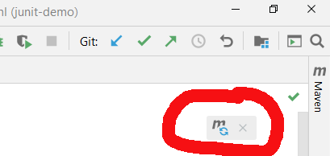

---
---
Automatické testy - Domácí úkol
-------------------------------

Po třetí lekci následuje domácí úkol:  
Bude třeba napsat několik automatizovaných testů reálné aplikace,
se kterou jste se už setkali:  
<https://cz-test-jedna.herokuapp.com/>

### Zadání

Vytvořte automatizované testy:

1.  Rodič s existujícím účtem se musí být schopen přihlásit do webové aplikace.

    Poznámka: Nepište automatizovaný test na zakládání nového účtu rodiče. 
    Účet si připravte dopředu ručně.

2.  Rodič musí být schopen vybrat kurz, přihlásit se do aplikace a přihlásit na kurz svoje dítě.

    Poznámka: I zde použijte už existující účet rodiče, jen se k němu v průběhu testu přihlašte.

    Poznámka: Úspěšné přihlášení dítěte na kurz je třeba po vyplnění přihlášky ověřit
    ve svém seznamu přihlášek.

3.  Rodič se musí být schopen přihlásit do aplikace, vyhledat kurz a přihlásit na něj svoje dítě.

    Poznámka: I zde použijte pro přihlášení do aplikace existující účet rodiče 
    a nezapomeňte ověřit, že přihláška na kurz proběhla úspěšně (v rodičově seznamu přihlášek).

4.  Jeden další scénář dle své úvahy.

### Tipy

-   Webová appka není uplně přátelská k automatizovaným testům.
    Hodně elementů bude třeba vyhledávat podle textu,
    protože jinak nejsou ničím odlišitelné od ostatních elementů.
    S tím se ale v realitě běžně potkáte.
    V dlouhodobém horizontu je vhodné požádat vývojáře o přídaní
    atributu `id` nebo `class` k vámi požadovaným elementům,
    v krátkodobém horizontu je ale potřeba se s tím smířit.

    Obecně vyhledávání elementů podle textů je nevhodné kvůli budoucím
    překladům webu do jiného jazyka nebo budoucím změnám textace.
    Z krátkodobého hlediska to ale zas takový problém není.

-   Někdy se může stát, že stejné tlačítko se stejným textem je na stránce vícekrát
    a vy si chcete vybrat například 3. výskyt.
    V takových případech je možné to udělat pomocí sofistikovaného dotazu XPath,
    nebo v Javě dvoukrokově.

    Například: Chcete kliknout na odkaz `Více informací` v obdelníčku 3. kurzu.
    Pokud je tedy element tlačítka například `<a>`,
    přesněji `
...<a>Více informací</a>...
`,
    můžete zkusit toto:

    *   XPath:
        ~~~~xpath
        ( //div[@class = 'card'] )[3]//a[text()='Více informací']
        ~~~~

    *   Java:  
        Nejprve vybrat pomocí `findElements()` všechny výskyty,
        a potom si ze seznamu (`List<WebElement>`) vybrat jen ten 1 element, na který jste mířili.

        ~~~~java
        List<WebElement> seznamTlacitekViceInformaciVsechKurzu =
                prohlizec.findElements(By.xpath(
                        "//div[@class = 'card']//a[text() = 'Více informací']"
                ));
        WebElement tretiTlacitkoViceInformaci = seznamTlacitekViceInformaciVsechKurzu.get(2);
        tretiTlacitkoViceInformaci.click();
        ~~~~

-   **Rozklikávací menu s termíny kurzů** lze vyplnit například tak,
    že kliknete do `
Vyberte termín...
` a potom zaÄnete psát
    do `
`...`<input type="search">`...`
`
    prvních pár číslic z datumu. Až to omezíte na jedinou možnost,
    stisknete `Enter`.

-   Pokud chcete stisknout v textovém políčku klávesu `Enter` (zvolit aktuální volbu),
    lze to provést pomocí zástupného znaku `\n`:

    ~~~~java
    polickoTerminuKurzu.sendKeys("\n");
    ~~~~

### Výchozí projekt

V reálném světě se jen zřídka zakládá nový projekt od začátku.
Většinou se postupuje tak, že se zkopíruje už existující,
dobře nakonfigurovaný projekt z minula,
přejmenuje se,
"vykostí se"
(smažou se nadbytečné javové třídy a metody)
a může se programovat.

Postupujte takto:
1.  Ve správci souborů (File Explorer, Finder, Total Commander, ...)
    zkopírujte složku existujícího projektu ze třetí lekce.
    Může to být například `10-JUnit_demo`.

2.  Otevřete kopii projektu v IntelliJ IDEA a opravte v něm v souboru `pom.xml`
    text v elementu `<artifactId>` z `junit-demo` na `domaci-ukol-jmeno-prijmeni`.
    `jmeno-prijmeni` nahraďte ze svoje jméno a příjmení 😊.

3.  Po změně aktivujte vpravo nahoře v IntelliJ IDEA malou bublinku
    Mavenu pro občerstvení konfigurace.

    

4.  Přejmenujte třídu `TestyTabulek` na `TestyPrihlasovaniNaKurzy`.

    Zařídíte to tak, že v IntelliJ IDEA v levém panelu `Projekt` 
    rozbalíte strom složek a souborů projektu tak, abyste našli soubor `TestyTabulek`,   
    kliknete na něj pravým tlačítkem a zvolíte `Refactor` -> `Rename`.

### Odevzdání

#### Termín odevzdání

Na projekt je jen týden, abychom řešení mohli prodiskutovat v poslední
lekci automatizovaného testování. Termín je tedy **čtvrtek 23:59**.
Vím, že je to velmi krátký čas, ale Digitální akademie je prostě náročná. 🙃

#### Postup odevzdání

Před odevzdáním je nutné projekt zbavit přeložených souborů
se strojovým kódem, protože posílání strojového kódu mohou antivirové programy
nebo Google Drive vyhodnotit jako riziko a zablokovat to.
Provedete to tak, že v IntelliJ IDEA vpravo nahoře zvolíte
`Maven` -> `domaci-ukol-jmeno-prijemni` -> `Lifecycle` -> `Clean`.
Úspěch se projeví tak, že v projektové složce zmizí
podsložka `target`.

Preferovaný způsob odevzdání je publikování na Github.
V IntelliJ IDEA to jde dokonce udělat téměř na jeden klik:
IntelliJ IDEA -> Menu -> `VCS` -> `Share project on Github`.

Delší, ale poctivější způsob je založit repository lokálně,
přidat do ní soubory projektu (`git add`),
založit prázdnou repository na Githubu,
nastavit lokální repository tak, aby věděla o vzdálené repository na Githubu
(IntelliJ IDEA -> Menu -> `Git` -> `Manage remotes`)
a nakonec provést `git push`.
Podobně jste to dělali v lekci Gitu (zhruba v čase 3:20:00).

Každou změnu v projektu je potom vždy potřeba nástrojem Git na vašem počítači *commitnout*
a *pushnout* opět na Github.
Adresu repository na Githubu vložte do `moje.czechitas.cz` při odevzdávání úkolu.

Pokud se na Github necítíte (což by byla ovšem škoda),
lze alternativně nahrát zip projektu
pojmenovaný `Automatizované-testy-ukol-Vase_Jmeno.zip`
na Google Drive a odkaz na soubor vložit do `moje.czechitas.cz` při odevzdávání úkolu.
